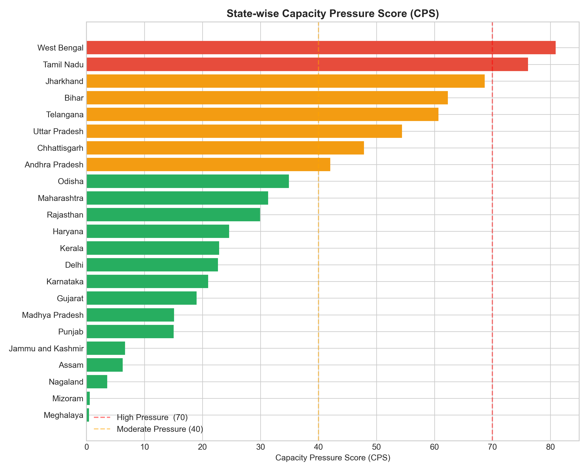
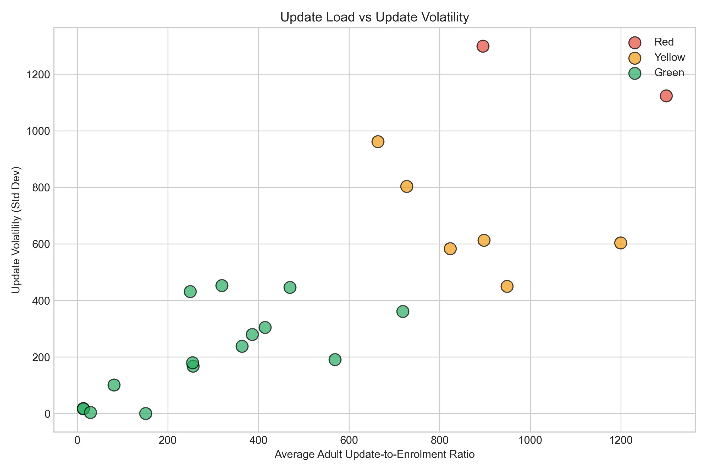
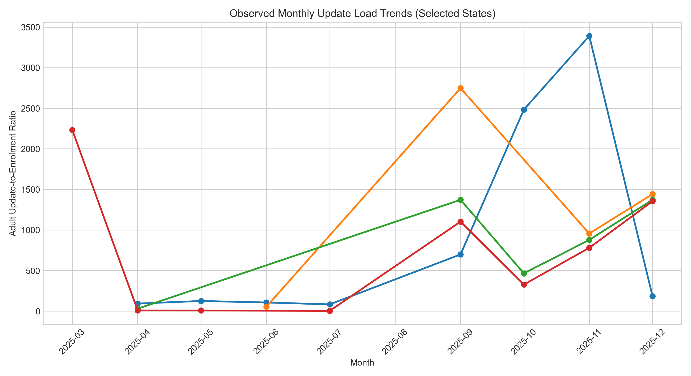

## 📄 Project Report

The complete project report submitted for the UIDAI Aadhaar Data Hackathon is available below:

👉 **[Download the full report (PDF)](CPS.UIDAI.pdf)**
---
UIDAI Capacity Pressure Score Framework
---
This repository contains the complete analytical workflow developed for the UIDAI Aadhaar Data Hackathon.

The project introduces a Capacity Pressure Score (CPS) to identify states experiencing disproportionate Aadhaar update loads relative to enrolment activity, enabling evidence-based capacity planning and operational prioritisation.

Repository Structure
---
Notebook 0 — Data Assembly
Builds clean, reproducible master datasets from raw UIDAI enrolment, demographic update, and biometric update files.

Notebook 1 — CPS Core Logic
Constructs the Capacity Pressure Score using update intensity, volatility, and adult-child skew. Produces state-level CPS classification.

Notebook 2 — Validation & Evidence
Performs stress testing, weight sensitivity analysis, anomaly detection, trend characterisation, and generates supporting visualisations.

Key Outputs
---
State-wise CPS scores and classifications (Red / Yellow / Green)

Anomaly detection for update load spikes

Trend indicators for future capacity pressure

Reproducible, transparent analysis suitable for policy review

## Key Visual Outputs

### State-wise Capacity Pressure Score

### Update Load vs Volatility

### Monthly Trends in High-Pressure States

All analysis is based exclusively on UIDAI-provided Aadhaar datasets.
